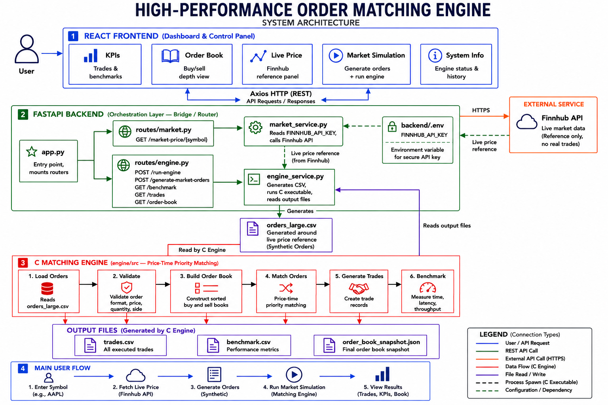
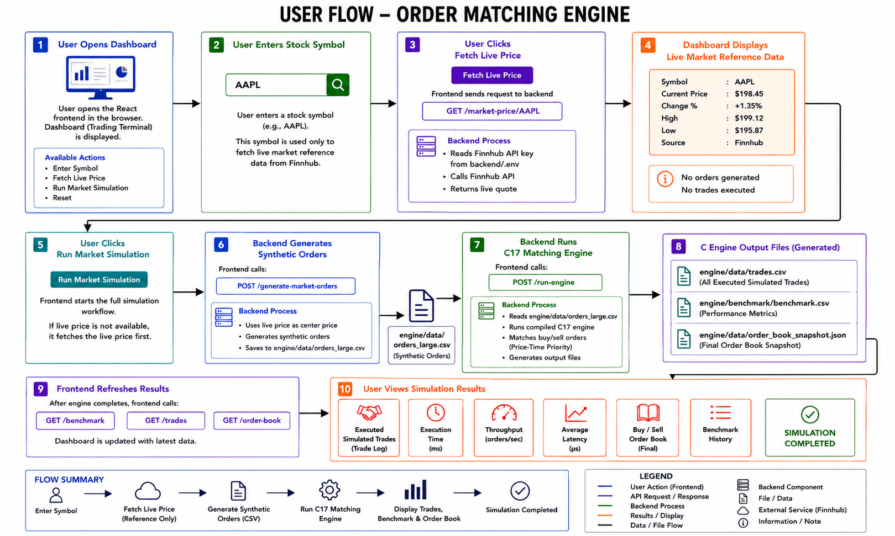
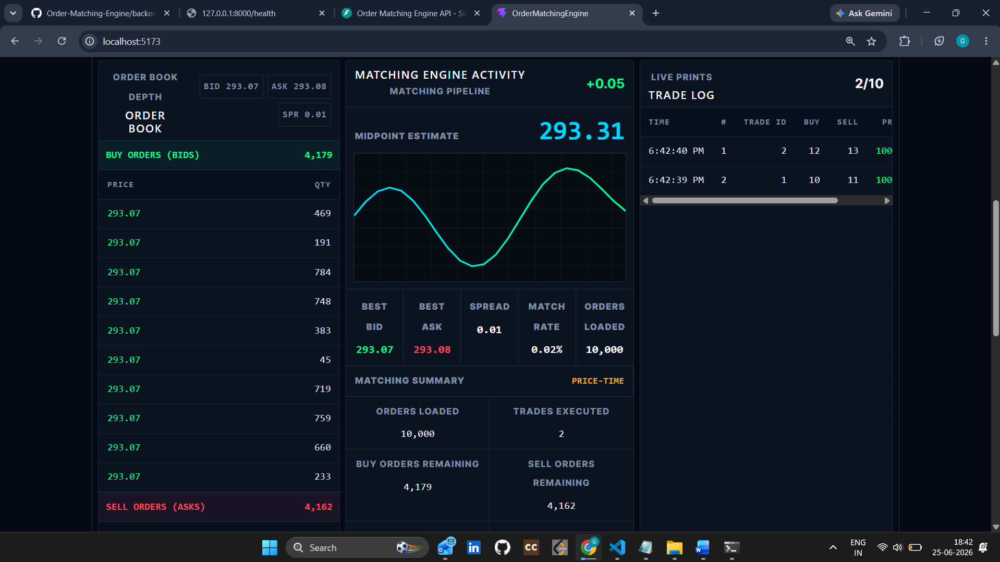
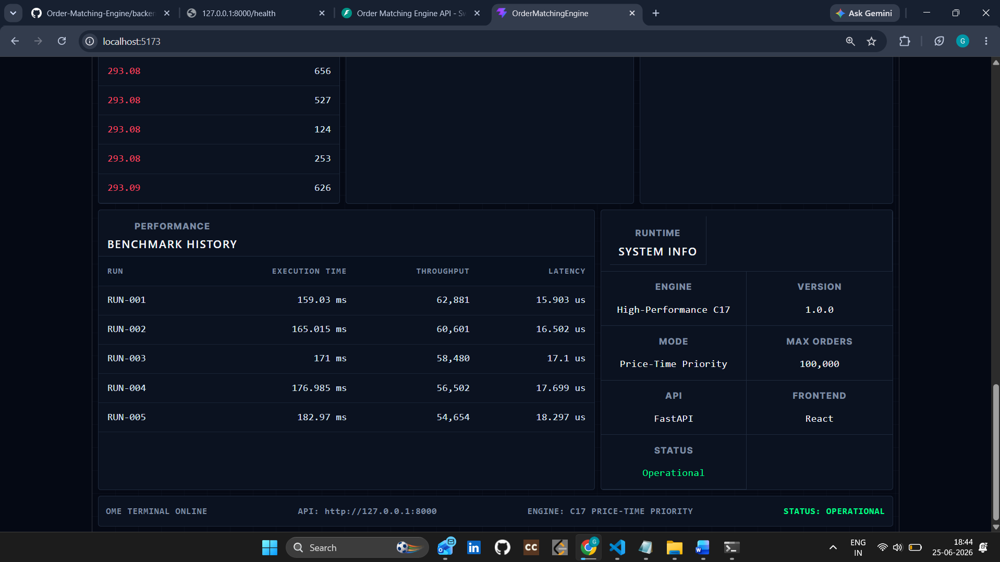
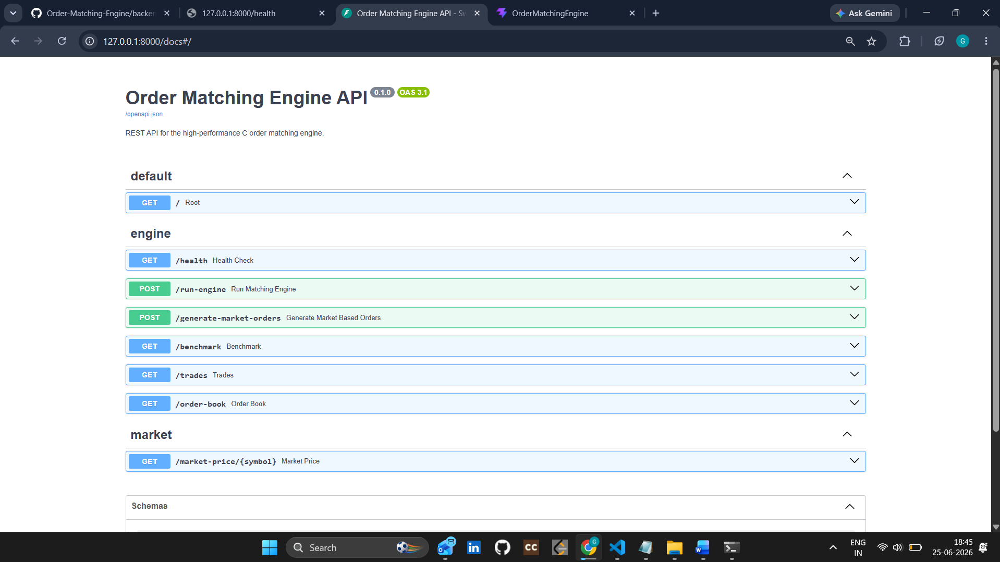

<h1 align="center">High-Performance Order Matching Engine</h1>

## Project Overview

This project is a full-stack order matching engine system that combines a high-performance C17 matching engine, a FastAPI backend, and a React trading-terminal dashboard. The system can fetch live market reference prices from Finnhub, generate realistic synthetic buy/sell orders around that live price, execute matching through the C engine, and display trades, benchmark metrics, and order book snapshots in the dashboard.

## Problem Statement

Electronic trading systems require fast and reliable order matching. A matching engine must process buy and sell orders, apply price-time priority, execute trades, update the order book, and produce performance metrics. Building such a system also requires a clear interface for testing, visualization, and benchmarking.

The key challenge is to demonstrate realistic market behavior without using real money or broker execution. This project solves that by using live market prices only as reference data for generating simulated orders.

## Solution

The solution uses a layered architecture:

- A C17 engine performs the core order book and matching logic.
- A FastAPI backend orchestrates live price fetching, synthetic order generation, engine execution, and file-based result retrieval.
- A React frontend provides a trading-terminal style dashboard for controlling and visualizing the simulation.
- Finnhub is used only for live market quote reference.

The workflow is:

1. Fetch live market price for a symbol.
2. Generate synthetic orders around that price.
3. Run the C17 matching engine.
4. Read generated trades, benchmark metrics, and order book snapshot.
5. Display results in the dashboard.

## Features

- Price-time priority order matching
- Buy and sell order books
- Partial fill support
- Trade history generation
- Order book snapshot generation
- Performance benchmarking
- CSV-based order input
- Live market quote lookup using Finnhub
- Synthetic market-based order generation
- FastAPI REST API
- React terminal-style dashboard
- KPI cards for execution time, throughput, latency, trades, and spread
- Clear separation between real market reference data and simulated trading

## System Architecture



## Userflow



### Fetch Live Price

The user enters a market symbol such as `AAPL` and clicks `Fetch Live Price`.

Flow:

```text
Frontend -> GET /market-price/AAPL -> FastAPI -> Finnhub -> Frontend
```

This only displays real market reference data. No orders are generated and no trades are executed.

### Run Market Simulation

The user clicks `Run Market Simulation`.

Flow:

```text
Frontend
  -> fetch live price if needed
  -> POST /generate-market-orders
  -> POST /run-engine
  -> GET /benchmark
  -> GET /trades
  -> GET /order-book
  -> update dashboard
```

The backend generates `engine/data/orders_large.csv` around the live price, then runs the C17 engine. The engine reads `engine/data/orders_large.csv`, matches simulated orders, and writes result files:

- `engine/data/trades.csv`
- `engine/benchmark/benchmark.csv`
- `engine/data/order_book_snapshot.json`

## Tech Stack

| Layer | Technology |
| --- | --- |
| Matching Engine | C17 |
| Compiler | GCC |
| Backend | Python, FastAPI, Uvicorn |
| API Client | Requests |
| Environment Variables | python-dotenv |
| Frontend | React, Vite |
| HTTP Client | Axios |
| Linting | oxlint |
| Market Data | Finnhub Quote API |
| Data Files | CSV, JSON |

## Project Structure

```text
OrderMatchingEngine/
├── backend/
│   ├── app.py
│   ├── routes/
│   │   ├── engine.py
│   │   └── market.py
│   ├── services/
│   │   ├── engine_service.py
│   │   └── market_service.py
│   ├── requirements.txt
│   └── .env
├── engine/
│   ├── include/
│   ├── src/
│   │   ├── main.c
│   │   ├── order.c
│   │   ├── order_book.c
│   │   ├── matching.c
│   │   ├── trade.c
│   │   ├── csv_loader.c
│   │   └── benchmark.c
│   ├── data/
│   │   ├── orders_large.csv
│   │   ├── trades.csv
│   │   └── order_book_snapshot.json
│   ├── benchmark/
│   │   ├── generate_orders.py
│   │   └── benchmark.csv
│   └── tests/
├── frontend/
│   ├── src/
│   │   ├── App.jsx
│   │   └── App.css
│   ├── package.json
│   └── vite.config.js
├── docs/
│   └── diagrams/
│       └── 2934c47d-7e23-4e7e-af60-5691a339b1e0.png
└── README.md
```

## API Endpoints

| Method | Endpoint | Purpose |
| --- | --- | --- |
| GET | `/health` | Backend health check |
| GET | `/market-price/{symbol}` | Fetch live Finnhub quote |
| POST | `/generate-market-orders` | Generate synthetic orders around live price |
| POST | `/run-engine` | Run compiled C matching engine |
| GET | `/benchmark` | Return latest benchmark metrics |
| GET | `/trades` | Return generated trade history |
| GET | `/order-book` | Return latest order book snapshot |

### Generate Market Orders Request

```json
{
  "symbol": "AAPL",
  "base_price": 201.25,
  "count": 10000
}
```

### Generate Market Orders Response

```json
{
  "success": true,
  "symbol": "AAPL",
  "base_price": 201.25,
  "orders_generated": 10000,
  "file": "engine/data/orders_large.csv"
}
```

## Installation

### Prerequisites

- GCC compiler
- Python 3.11+
- Node.js and npm
- Finnhub API key

### Backend Setup

```powershell
cd "C:\Users\gagan\OneDrive\Desktop\OrderMatchingEngine\backend"
python -m venv venv
.\venv\Scripts\Activate
pip install -r requirements.txt
```

Create `backend/.env`:

```env
FINNHUB_API_KEY=your_finnhub_api_key_here
```

### Frontend Setup

```powershell
cd "C:\Users\gagan\OneDrive\Desktop\OrderMatchingEngine\frontend"
npm.cmd install
```

## How to Run

### 1. Compile the C Engine

```powershell
cd "C:\Users\gagan\OneDrive\Desktop\OrderMatchingEngine\engine"
gcc -std=c17 src\main.c src\order.c src\order_book.c src\matching.c src\trade.c src\csv_loader.c src\benchmark.c -Iinclude -o order_matching_engine.exe
```

### 2. Start Backend

```powershell
cd "C:\Users\gagan\OneDrive\Desktop\OrderMatchingEngine\backend"
.\venv\Scripts\Activate
uvicorn app:app --reload
```

Backend runs at:

```text
http://127.0.0.1:8000
```

API docs:

```text
http://127.0.0.1:8000/docs
```

### 3. Start Frontend

```powershell
cd "C:\Users\gagan\OneDrive\Desktop\OrderMatchingEngine\frontend"
npm.cmd run dev
```

Frontend runs at:

```text
http://localhost:5173
```

### 4. Use Dashboard

1. Enter a symbol such as `AAPL`.
2. Click `Fetch Live Price`.
3. Click `Run Market Simulation`.
4. Review generated trades, order book rows, and benchmark metrics.

## Screenshots

### React Dashboard


### Live Price Fetched


### Run Market Simulation


### Order Activity and Trade Log



### Benchmark System Information



### Compile C Engine


### Swagger Docs



## Benchmark Results

Latest benchmark sample:

| Orders Processed | Execution Time | Throughput | Avg Latency |
| --- | --- | --- | --- |
| 10,000 | 86.000 ms | 116,279.070 ops/sec | 8.600 us |

Benchmark output is stored in:

```text
engine/benchmark/benchmark.csv
```

## Conclusion

<p align="justify">
The High-Performance Order Matching Engine demonstrates how a low-level C17 matching core can be integrated with a modern FastAPI backend and React dashboard. By using live market prices only as reference data, the system creates realistic simulated order flow without placing real trades. The result is a complete, safe, and extensible platform for understanding order matching, benchmarking engine performance, and visualizing market simulation results.
</p>
