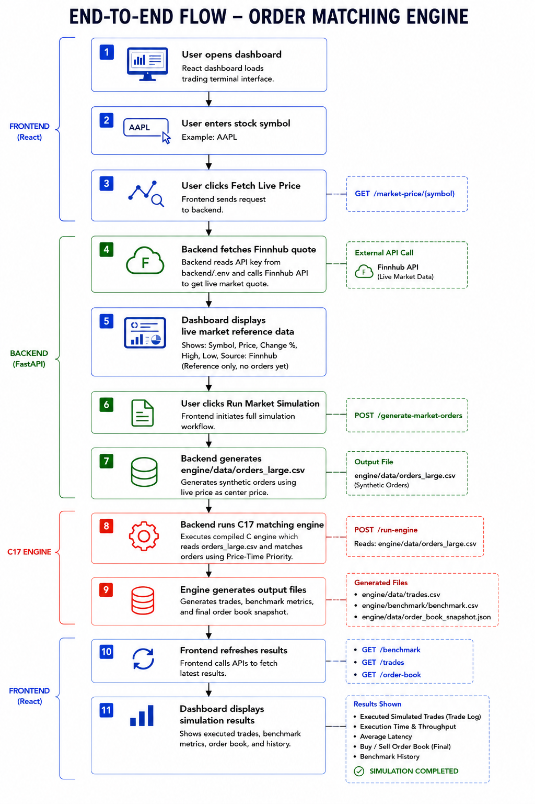

# Phase 4 - Testing Documentation

## Test Plan

### Objective

The objective of testing is to verify that the Order Matching Engine works correctly across all layers:

- C17 matching engine
- FastAPI backend
- React frontend
- File-based data outputs
- Market-based synthetic order generation
- End-to-end market simulation workflow

### Scope

Testing covers:

- Engine compilation and execution
- Synthetic order generation
- Live market price API behavior
- Backend API endpoints
- Frontend dashboard workflow
- Generated CSV/JSON files
- Benchmark output
- Full system integration

Testing does not cover:

- Real trade execution
- Broker API integration
- Production deployment monitoring
- Payment or financial transaction flows

### Testing Strategy

| Test Type | Purpose |
| --- | --- |
| Unit/Function Testing | Verify individual backend and engine functions |
| API Testing | Verify all FastAPI endpoints |
| Frontend Testing | Verify dashboard workflow and UI behavior |
| File Testing | Verify generated CSV/JSON files |
| Performance Testing | Verify benchmark metrics from the C engine |
| System Testing | Verify complete workflow from live price to dashboard results |

### Test Environment

| Component | Environment |
| --- | --- |
| OS | Windows |
| Compiler | GCC |
| Backend | Python, FastAPI, Uvicorn |
| Frontend | React, Vite |
| API Tool | Browser, curl, Thunder Client |
| Market Data | Finnhub |

## Test Cases

| Test Case ID | Test Scenario | Steps | Expected Result | Status |
| --- | --- | --- | --- | --- |
| TC-01 | Compile C engine | Run GCC compile command in `engine/` | `order_matching_engine.exe` is created | Pass |
| TC-02 | Run C engine | Execute `order_matching_engine.exe` | Engine loads orders and prints benchmark/trade sections | Pass |
| TC-03 | Verify generated files | Check `trades.csv`, `benchmark.csv`, `order_book_snapshot.json` | Files exist and contain readable data | Pass |
| TC-04 | Backend health check | Call `GET /health` | Returns service status JSON | Pass |
| TC-05 | Fetch live market price | Call `GET /market-price/AAPL` | Returns live quote or clear API-key/network error | Pass |
| TC-06 | Generate market orders | Call `POST /generate-market-orders` with valid body | Generates `engine/data/orders_large.csv` | Pass |
| TC-07 | Invalid base price | Call `POST /generate-market-orders` with `base_price: 0` | Returns `success: false` with validation message | Pass |
| TC-08 | Invalid count | Call `POST /generate-market-orders` with `count: 0` | Returns `success: false` with validation message | Pass |
| TC-09 | Run engine API | Call `POST /run-engine` | Returns success and benchmark summary | Pass |
| TC-10 | Get benchmark | Call `GET /benchmark` | Returns latest benchmark row | Pass |
| TC-11 | Get trades | Call `GET /trades` | Returns trade array | Pass |
| TC-12 | Get order book | Call `GET /order-book` | Returns buy/sell order book snapshot | Pass |
| TC-13 | Fetch Live Price button | Click frontend `Fetch Live Price` | Live Market Reference panel updates | Pass |
| TC-14 | Run Market Simulation button | Click frontend `Run Market Simulation` | Orders generated, engine runs, dashboard refreshes | Pass |
| TC-15 | Reset button | Click frontend `Reset` | Dashboard state returns to default values | Pass |
| TC-16 | Frontend build | Run `npm.cmd run build` | Production build completes | Pass |
| TC-17 | Frontend lint | Run `npm.cmd run lint` | No lint errors | Pass |

## Test Results

### Summary

| Area | Result |
| --- | --- |
| C engine compilation | Passed |
| C engine execution | Passed |
| Backend API | Passed |
| Market order generation | Passed |
| Frontend build | Passed |
| Frontend lint | Passed |
| File generation | Passed |
| End-to-end simulation workflow | Passed |

### Latest Observed Results

Engine output included:

```text
Orders Loaded: 10000
BENCHMARK RESULTS
TRADE HISTORY
```

Generated files verified:

```text
engine/data/trades.csv
engine/data/order_book_snapshot.json
engine/benchmark/benchmark.csv
```

Frontend checks verified:

```text
npm.cmd run build
npm.cmd run lint
```

Both completed successfully.

## Performance Testing

### Objective

Performance testing verifies that the C17 engine can process a large order set efficiently and produce benchmark metrics.

### Input

```text
engine/data/orders_large.csv
```

Default order count:

```text
10000
```

### Metrics Captured

| Metric | Description |
| --- | --- |
| Orders Processed | Total orders processed by the engine |
| Execution Time | Total runtime in milliseconds |
| Throughput | Orders processed per second |
| Average Latency | Average processing latency per order |

### Sample Benchmark Result

```csv
orders_processed,execution_time_ms,throughput_ops_sec,avg_latency_us
10000,86.000,116279.070,8.600
```

### Expected Performance

The engine should process 10,000 orders and generate benchmark output without crashing or timing out.

## API Testing

### Tested Endpoints

| Method | Endpoint | Expected Result |
| --- | --- | --- |
| GET | `/health` | Returns backend health status |
| GET | `/market-price/{symbol}` | Returns live quote or clear error |
| POST | `/generate-market-orders` | Generates synthetic orders CSV |
| POST | `/run-engine` | Runs C engine and returns summary |
| GET | `/benchmark` | Returns benchmark metrics |
| GET | `/trades` | Returns trade list |
| GET | `/order-book` | Returns order book snapshot |

### API Test Examples

Health check:

```powershell
curl.exe http://127.0.0.1:8000/health
```

Expected:

```json
{
  "status": "ok",
  "service": "order-matching-engine"
}
```

Generate market orders:

```json
{
  "symbol": "AAPL",
  "base_price": 201.25,
  "count": 10000
}
```

Expected:

```json
{
  "success": true,
  "symbol": "AAPL",
  "base_price": 201.25,
  "orders_generated": 10000,
  "file": "engine/data/orders_large.csv"
}
```

## Frontend Testing

### Objective

Frontend testing verifies that the React dashboard supports the intended user workflow and displays backend data clearly.

### Tested UI Areas

| UI Area | Expected Behavior |
| --- | --- |
| Symbol input | Accepts stock symbol input |
| Fetch Live Price | Fetches and displays live market reference data |
| Live Market Reference panel | Shows symbol, current price, change %, high, low, and source |
| Run Market Simulation | Generates orders, runs engine, refreshes dashboard |
| Market Simulation Engine panel | Shows generated orders, engine type, trades, benchmark status |
| KPI cards | Show trades, execution time, throughput, latency, and spread |
| Order book | Shows buy and sell orders |
| Trade log | Shows executed simulated trades |
| Benchmark history | Shows benchmark metrics |
| Reset | Clears frontend dashboard state |

### Build and Lint Testing

Commands:

```powershell
cd "C:\Users\gagan\OneDrive\Desktop\OrderMatchingEngine\frontend"
npm.cmd run build
npm.cmd run lint
```

Expected:

```text
Build succeeds
No lint errors
```

## System Testing

### Objective

System testing validates the complete end-to-end flow from user action to generated simulation results.

### End-to-End Flow

The following diagram shows the full system-level test flow from the user action in the React dashboard to backend processing, C17 engine execution, file generation, API refresh, and final dashboard output.



This flow verifies that the frontend, backend APIs, generated files, and C matching engine work together as one complete system.

### System Test Criteria

| Criteria | Expected Result |
| --- | --- |
| Backend starts successfully | API available at `http://127.0.0.1:8000` |
| Frontend starts successfully | Dashboard available at `http://localhost:5173` |
| Live price can be fetched | Live data panel updates |
| Market simulation can run | C engine executes successfully |
| Files are generated | CSV/JSON outputs exist |
| Dashboard refreshes | KPIs, trades, benchmark, and order book update |
| No real trades placed | System remains simulation-only |

### System Test Result

The complete system workflow is considered successful when:

- `LIVE DATA MODE ACTIVE` appears after fetching live price.
- `SIMULATION COMPLETED` appears after running market simulation.
- Benchmark metrics are visible.
- Trade log contains simulated trades.
- Order book shows buy/sell rows.
- No broker or real-trade API is called.
